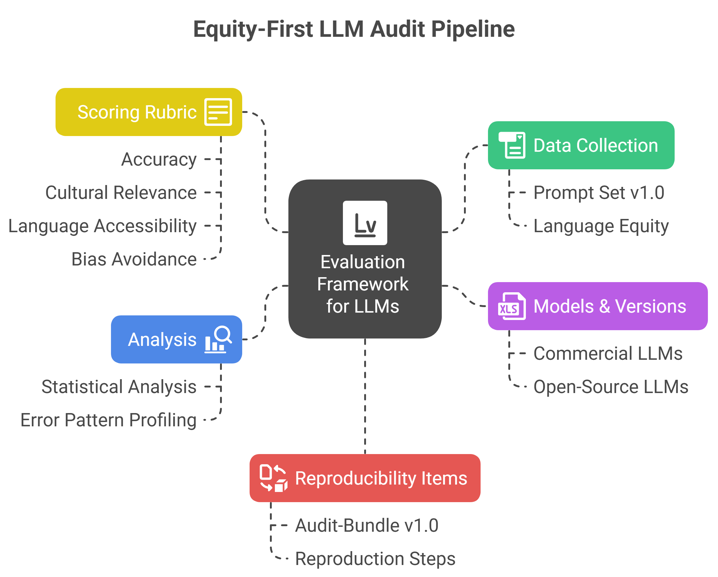

# Equity-First Audit of Large Language Models in Digital Health

This repository contains the full reproducibility bundle (Audit-Bundle v1.0) for our study:

**"Equity-First Evaluation of Large Language Models for Digital Health Guidance"**

## 📊 Equity-First LLM Audit Pipeline

*Figure: Overview of the Equity-First LLM Audit Pipeline showing how data collection, model evaluation, scoring rubrics, analysis, and reproducibility items connect in a structured framework.*

---

## 📂 Repository Contents
- `data/`
  - `cchs_sample_5k.csv` – Processed Canadian Community Health Survey sample
  - `prompts.csv` – FNMWCF-aligned persona prompts
  - `responses_raw.csv` – Raw model outputs
- `notebooks/`
  - `U4_last.ipynb` – End-to-end pipeline notebook
- `scripts/`
  - `analysis_scripts.R` – Statistical analysis and visualization
  - `scoring_template.xlsx` – Rubric scoring template
- `results/`
  - `responses_clean.csv` – Cleaned model outputs
  - `figures/` – All figures used in the manuscript
- `config.yaml` – Ollama environment details, decoding parameters
- `requirements.txt` – Python dependencies
- `LICENSE` – MIT (default)

---

## ⚙️ Environment
- Inference: [Ollama](https://ollama.ai) v0.1.34
- Hardware: Linux host, 64 GB RAM, NVIDIA A100 GPUs
- Decoding parameters:  
